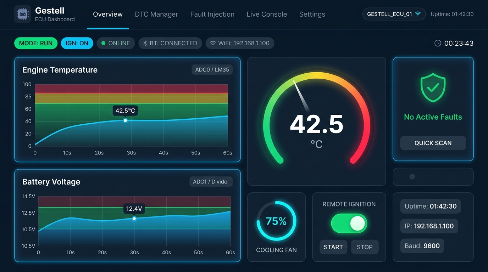
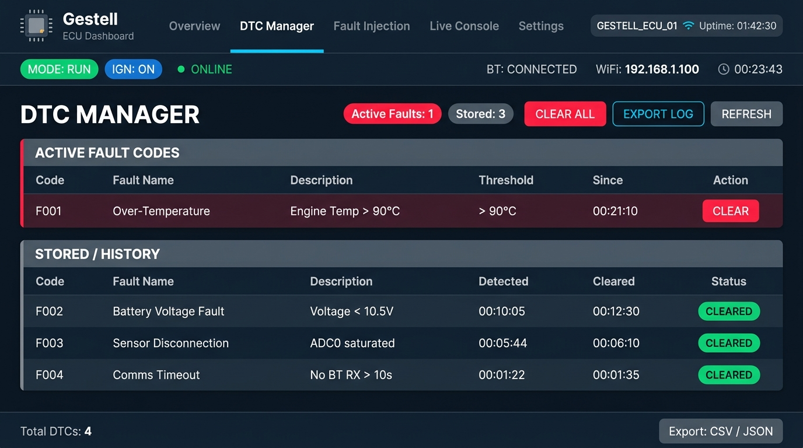
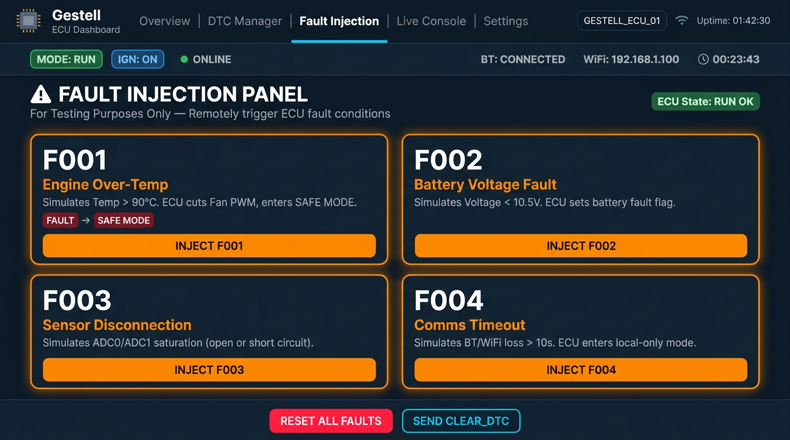
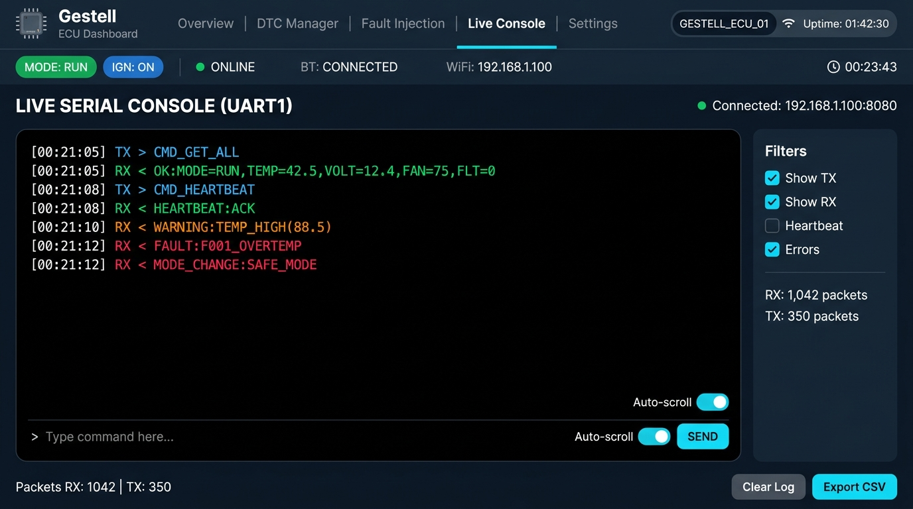
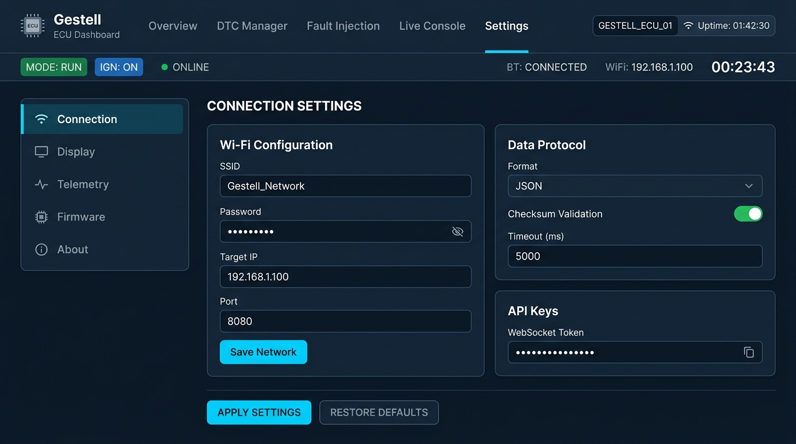
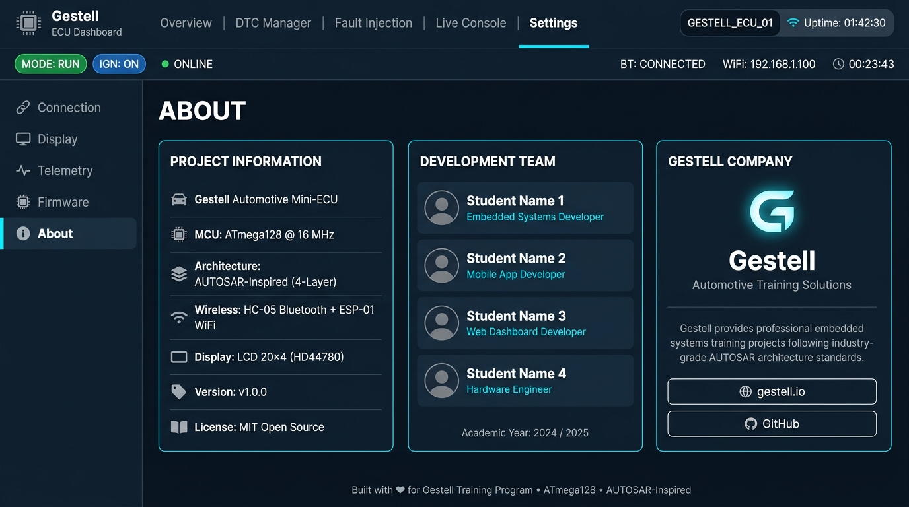
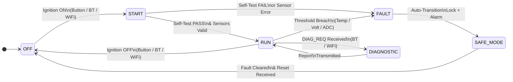
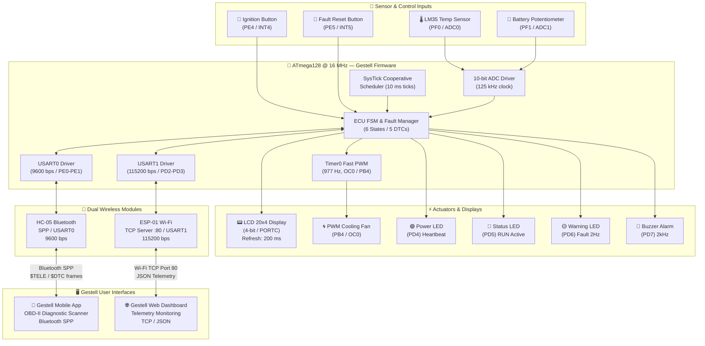
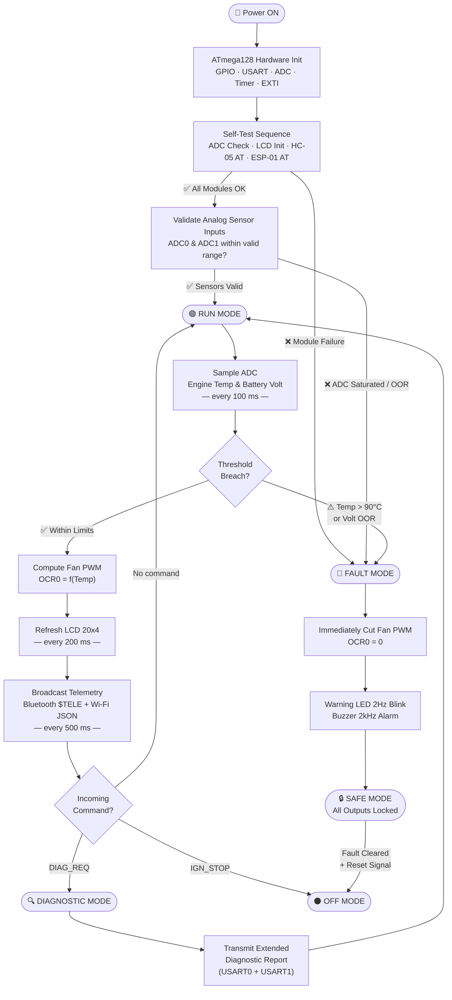

<div align="center">

<br/>


# Automotive Electronic Control Unit

### Mini ECU — Gestell Embedded Systems Training Project

<br/>

[](https://github.com)&nbsp;
[](https://github.com)&nbsp;
[](https://github.com)&nbsp;
[](https://github.com)&nbsp;
[](https://github.com)&nbsp;
[](https://github.com)&nbsp;
[](https://github.com)&nbsp;
[](https://github.com)

<br/>

---

| [📋 Outline](#-project-outline) | [🎯 Objectives](#-project-objectives) | [📖 Overview](#-project-overview) | [⚙️ Requirements](#-system-requirements) | [🧠 MCU Specs](#-hardware-specifications--microcontroller-peripherals) |
|:---:|:---:|:---:|:---:|:---:|
| [📟 LCD 20x4](#-lcd-20x4-interface-display-system) | [📌 Pinout](#-atmega128-pin-assignment-reference) | [🏗️ Architecture](#-gestell-layered-software-architecture-autosar-inspired) | [📶 Wireless](#-wireless-communication-protocols--telemetry-packets) | [🌐 Dashboard](#-gestell-web-dashboard) |
| [📱 Mobile App](#-gestell-mobile-diagnostic-app) | [🔄 ECU Modes](#-ecu-operating-modes--state-transitions) | [📊 Diagrams](#-system-diagrams--state-machine) | [🚨 Fault DTCs](#-fault-management--diagnostic-trouble-codes-dtc) | &nbsp; |

---

<br/>

</div>

## 📋 Project Outline

This document is the complete technical specification and engineering reference for the **Gestell Automotive Mini ECU** — a full-featured embedded system that simulates the core intelligence of a real automotive Electronic Control Unit (ECU). The project demonstrates embedded software engineering from bare-metal MCAL drivers up through to wireless-connected user interfaces.

| # | Section | Summary |
|:---:|:---|:---|
| 1 | **Project Objectives** | Engineering goals, learning outcomes, and skills demonstrated |
| 2 | **Project Overview** | High-level system description and component interconnection |
| 3 | **System Requirements** | Detailed Functional (FR) and Non-Functional (NFR) requirements |
| 4 | **Hardware Specifications** | ATmega128 MCU peripheral configuration, clock, memory, and register details |
| 5 | **LCD 20x4 Display Interface** | HD44780 4-bit mode, cockpit display layout, and refresh strategy |
| 6 | **Pin Assignment Reference** | Complete hardware pinout for all signals, ports, and components |
| 7 | **Software Architecture** | 4-layer AUTOSAR-inspired firmware design and layer responsibilities |
| 8 | **Wireless Communication** | Bluetooth & Wi-Fi protocols, frame formats, AT commands, JSON payloads |
| 9 | **Web Dashboard** | ESP-01 Wi-Fi telemetry dashboard, remote control, and fault injection |
| 10 | **Mobile Diagnostic App** | HC-05 Bluetooth OBD-II scanner, DTC management, and cockpit UI |
| 11 | **ECU Operating Modes** | Detailed description of all 6 FSM states and their transition conditions |
| 12 | **System Diagrams & State Machine** | ECU FSM, hardware data flow, and operating flowchart diagrams |
| 13 | **Fault Management & DTCs** | DTC table, fault thresholds, fail-safe actions, and recovery protocols |

---

## 🎯 Project Objectives

The **Gestell Automotive Mini ECU** project is designed to build deep expertise in automotive-grade embedded systems engineering. It bridges the gap between theoretical knowledge and real-world embedded product development by applying industry practices in a structured training context.

### 🎓 Learning & Engineering Objectives

| # | Objective | Detailed Description |
|:---:|:---|:---|
| 1 | **ATmega128 Deep Peripheral Mastery** | Configure and control all major ATmega128 peripherals from scratch in bare-metal C: Dual Hardware USART (interrupt-driven with ring buffers), 10-bit ADC (polling + free-running modes), Timer0/2 Fast PWM (fan speed control), External Interrupts INT4/INT5 (ignition & reset), and GPIO DIO across multiple ports. |
| 2 | **AUTOSAR-Inspired Layered Architecture** | Design and implement a strict 4-layer firmware stack (MCAL → HAL → Service/OS → APP) that eliminates cross-layer hardware register access, enables unit testing of upper layers, and ensures hardware portability. |
| 3 | **Finite State Machine (FSM) Design** | Build a formally defined FSM with 6 operating states (`OFF`, `START`, `RUN`, `DIAGNOSTIC`, `FAULT`, `SAFE MODE`), documented transition guards, entry/exit actions, and safe state locking behavior under fault conditions. |
| 4 | **Dual Concurrent Wireless Communication** | Manage two independent wireless serial channels simultaneously: USART0 for Bluetooth (HC-05) and USART1 for Wi-Fi (ESP-01), each with dedicated interrupt-driven buffers, command parsers, and telemetry broadcast logic. |
| 5 | **Real-Time Embedded Scheduling** | Implement a cooperative SysTick-based task scheduler with 10 ms tick resolution, managing periodic tasks for ADC sampling (100 ms), LCD refresh (200 ms), telemetry broadcast (500 ms), and watchdog monitoring. |
| 6 | **Automotive Fault Detection & FDIR** | Implement a complete Fault Detection, Isolation, and Recovery (FDIR) system with threshold-based monitoring, DTC code generation (F001–F005), fail-safe actuator cutoff, and multi-path recovery logic. |
| 7 | **Full-Stack Embedded Product Integration** | Integrate the ATmega128 firmware with a real-time Web Dashboard (via ESP-01 TCP + JSON) and a Mobile Diagnostic App (via HC-05 Bluetooth SPP), demonstrating end-to-end embedded IoT product development. |

---

## 📖 Project Overview

The **Gestell Automotive Mini ECU** is a production-grade automotive embedded control system engineered under the **Gestell Training Framework**. Built around the **ATmega128 AVR Microcontroller** running at **16 MHz**, this system faithfully simulates the operational intelligence, safety interlocks, and sensor management of a modern vehicle ECU.

The ECU acquires analog data from two sensors — an **LM35 temperature sensor** (engine temperature) and a **potentiometer** (battery voltage simulation) — via the ATmega128's **10-bit ADC**. Based on these readings, it autonomously adjusts the duty cycle of a **PWM-controlled cooling fan** using Timer0 Fast PWM, enforces operational safety thresholds, and broadcasts the full system telemetry every 500 ms over two simultaneous wireless channels.

A **20x4 HD44780 Character LCD** provides a local cockpit dashboard — refreshed every 200 ms — displaying system state, sensor readings, fan speed, active faults, and wireless link status across 4 dedicated lines.

Two parallel wireless communication pathways are active during RUN mode:

| Channel | Module | USART | Target Interface | Baud Rate | Protocol |
|:---:|:---:|:---:|:---|:---:|:---:|
| 🔵 Bluetooth | HC-05 | USART0 (`PE0`/`PE1`) | Gestell Mobile Diagnostic App | 9600 bps | SPP / Custom ASCII Frames |
| 🌐 Wi-Fi | ESP-01 | USART1 (`PD2`/`PD3`) | Gestell Web Dashboard | 115200 bps | TCP Server / JSON Telemetry |

---

## ⚙️ System Requirements

### ✅ Functional Requirements

| # | ID | Requirement Description | Priority |
|:---:|:---:|:---|:---:|
| 1 | `FR-01` | The ECU shall execute a full hardware self-test sequence on every power-up, verifying: ADC channel integrity, LCD 20x4 initialization response, HC-05 Bluetooth USART0 ACK, and ESP-01 Wi-Fi module AT response. | 🔴 High |
| 2 | `FR-02` | The ECU shall implement a 6-state Finite State Machine: `OFF` → `START` → `RUN` → `DIAGNOSTIC` → `FAULT` → `SAFE MODE`, with defined entry/exit actions and guarded transition conditions for each state. | 🔴 High |
| 3 | `FR-03` | In `RUN` mode, the ECU shall sample Engine Temperature (LM35 on ADC0) and Battery Voltage (Potentiometer on ADC1) at a minimum rate of 10 Hz (every 100 ms) using the ATmega128 10-bit ADC with AVCC reference and prescaler = 128. | 🔴 High |
| 4 | `FR-04` | The ECU shall compute the Cooling Fan PWM duty cycle as a linear function of measured engine temperature between `T_min = 40°C` (0% duty) and `T_max = 90°C` (100% duty), using Timer0 Fast PWM on `PB4` (OC0). | 🔴 High |
| 5 | `FR-05` | The ECU shall refresh the 20x4 HD44780 LCD display every 200 ms displaying: Line 1 (Mode & Ignition), Line 2 (Temp & Battery Voltage), Line 3 (Fan PWM % & Active DTC), Line 4 (BT link status & Wi-Fi link status). | 🔴 High |
| 6 | `FR-06` | The ECU shall broadcast a structured ASCII telemetry frame over Bluetooth (USART0) every 500 ms in format: `$TELE,<TEMP>,<BATT>,<PWM>,<FAULT>*<CS>\r\n`. | 🔴 High |
| 7 | `FR-07` | The ECU shall broadcast a structured JSON telemetry payload over Wi-Fi (USART1) via TCP to port 80 every 500 ms, including: `ecu_id`, `mode`, `temp_c`, `battery_v`, `fan_pwm`, `fault`, `uptime_s`. | 🔴 High |
| 8 | `FR-08` | The ECU shall parse and execute remote commands received over both USART channels: `IGN_START`, `IGN_STOP`, `READ_DTC`, `CLEAR_DTC`, `DIAG_REQ`. | 🟠 Medium |
| 9 | `FR-09` | The ECU shall automatically detect fault conditions — Over-Temperature (`>90°C`), Battery Voltage out-of-range (`<10.5V` or `>16V`), Sensor Disconnection (ADC saturation), Wireless Timeout — and immediately transition to `FAULT` mode. | 🔴 High |
| 10 | `FR-10` | Upon entering `FAULT` mode, the ECU shall: disable Fan PWM output, activate Warning LED (`PD6`) with 2 Hz blink, and activate Buzzer Alarm (`PD7`) at 2 kHz, then immediately transition to `SAFE MODE`. | 🔴 High |
| 11 | `FR-11` | In `SAFE MODE`, the ECU shall lock all actuator outputs and reject all ignition commands until: the fault condition is physically resolved AND a valid Reset signal is received (hardware button `PE5` or `CLEAR_DTC` command). | 🔴 High |
| 12 | `FR-12` | The `DIAGNOSTIC` mode shall transmit an extended diagnostic report over both wireless channels including: current DTC list, last 5 sensor readings, uptime, MCU clock state, and all actuator states. | 🟠 Medium |
| 13 | `FR-13` | The Ignition state shall be controllable from three independent sources: Physical Push Button (`INT4` / `PE4`), Bluetooth command (`IGN_START` / `IGN_STOP`), and Wi-Fi web command. All sources shall have equal authority. | 🟠 Medium |
| 14 | `FR-14` | The ECU shall maintain a soft real-time heartbeat LED indicator (`PD4` — Green Power LED) toggling at 1 Hz during `RUN` mode to indicate normal system operation. | 🟡 Low |

---

### 📐 Non-Functional Requirements

| # | ID | Requirement Description | Category |
|:---:|:---:|:---|:---:|
| 1 | `NFR-01` | The firmware shall enforce a strict 4-layer AUTOSAR-inspired architecture. No code above the MCAL layer may read or write hardware registers directly. All hardware access must go through designated MCAL API functions. | Architecture |
| 2 | `NFR-02` | Each firmware layer shall expose only its public API header (`.h`) to the layer above. Internal implementation files (`.c`) shall never be `#include`d by an upper layer. | Modularity |
| 3 | `NFR-03` | All periodic tasks (ADC sampling, LCD refresh, telemetry broadcast, fault monitoring) shall be driven by a non-blocking cooperative SysTick scheduler with 10 ms tick resolution. No blocking `delay()` calls are permitted in the main control loop. | Real-Time |
| 4 | `NFR-04` | USART RX/TX on both USART0 and USART1 shall use interrupt-driven circular ring buffers (minimum 64-byte capacity each direction) to prevent data loss at operating baud rates. | Performance |
| 5 | `NFR-05` | Fault detection logic shall evaluate sensor readings within a maximum of 2 scheduler ticks (≤ 20 ms) from sample acquisition. Fault-to-SAFE_MODE transition shall complete within 50 ms of initial detection. | Safety |
| 6 | `NFR-06` | The firmware shall not use dynamic memory allocation (`malloc`, `calloc`, `free`). All buffers, queues, and state variables shall be statically allocated with known worst-case sizes at compile time. | Memory Safety |
| 7 | `NFR-07` | All MCU peripheral initialization (GPIO direction, USART baud rate, ADC reference, Timer prescaler, EXTI mode) shall be encapsulated in dedicated MCAL `init()` functions. Boot init sequence shall complete in under 500 ms. | Portability |
| 8 | `NFR-08` | The codebase shall follow MISRA-C inspired conventions: meaningful variable/function naming, consistent comment headers per module, max function length of 50 lines, and max nesting depth of 4. | Maintainability |
| 9 | `NFR-09` | In the event of loss of both Bluetooth and Wi-Fi connections simultaneously, the ECU shall continue local autonomous operation (ADC sampling, LCD update, Fan PWM control) without any system degradation for an indefinite period. | Reliability |
| 10 | `NFR-10` | The Web Dashboard telemetry charts shall refresh at a maximum interval of 500 ms. The Mobile App sensor display shall update within 1 second of receiving a new telemetry packet from the ECU. | Usability |
| 11 | `NFR-11` | The ESP-01 Wi-Fi AT-command initialization sequence shall complete with a retry mechanism — up to 3 retries on CWJAP failure before logging an `F004` Comms Fault and falling back to local-only mode. | Robustness |
| 12 | `NFR-12` | The LCD driver shall implement a dirty-flag update mechanism: only LCD rows whose content has changed since the last refresh cycle shall be re-written, to minimize I2C/parallel bus write overhead. | Performance |

---

## 🧠 Hardware Specifications & Microcontroller Peripherals

### ATmega128 Microcontroller Core

| Parameter | Value |
|:---|:---|
| **Vendor / Family** | Atmel (Microchip) — AVR 8-bit RISC |
| **System Clock** | 16 MHz (External Crystal Oscillator) |
| **Flash Program Memory** | 128 KB (64K × 16-bit words) |
| **SRAM Data Memory** | 4 KB (4096 bytes) |
| **EEPROM** | 4 KB — used for DTC log persistence across power cycles |
| **Operating Voltage** | 4.5 V – 5.5 V (5V regulated supply) |
| **I/O Ports** | 7 full 8-bit ports: A, B, C, D, E, F, G |
| **Hardware USARTs** | 2 independent (USART0 & USART1) with dedicated TX/RX pin pairs |
| **ADC Channels** | 8-channel, 10-bit SAR ADC (PORTF, ADC0–ADC7) |
| **Timers** | Timer0 (8-bit), Timer1 (16-bit), Timer2 (8-bit), Timer3 (16-bit) |
| **External Interrupts** | 8 (INT0–INT7) with configurable edge/level triggering |
| **SPI** | Full-duplex hardware SPI on PORTB |
| **I2C (TWI)** | Hardware TWI on PORTE |

---

### 🔌 Dual Hardware USART Configuration

#### USART0 — HC-05 Bluetooth Module

| Register | Value | Purpose |
|:---|:---:|:---|
| `UBRRH0` / `UBRRL0` | `0x00` / `0x67` | Baud rate 9600 bps @ 16 MHz (UBRR = 103) |
| `UCSR0A` | `0x00` | Normal speed, no double-speed |
| `UCSR0B` | `0xD8` | RX Complete IRQ ON, TX Complete IRQ ON, RXen, TXen |
| `UCSR0C` | `0x86` | Async USART, No Parity, 1 Stop bit, 8 Data bits |

**Software Configuration**: Interrupt-driven with **two 64-byte circular ring buffers** (one RX, one TX). The ISR pushes received bytes to the RX ring buffer; the command parser task reads from this buffer every 10 ms scheduler tick and assembles complete command frames delimited by `\r\n`.

#### USART1 — ESP-01 Wi-Fi Module

| Register | Value | Purpose |
|:---|:---:|:---|
| `UBRRH1` / `UBRRL1` | `0x00` / `0x08` | Baud rate 115200 bps @ 16 MHz (UBRR = 8) |
| `UCSR1B` | `0xD8` | RX Complete IRQ ON, TX Complete IRQ ON, RXen, TXen |
| `UCSR1C` | `0x86` | Async USART, No Parity, 1 Stop bit, 8 Data bits |

**Software Configuration**: Same circular buffer architecture. AT-command engine operates in **AT Passthrough Mode** during init, then switches to **Transparent Data Mode** after TCP connection is established. A 128-byte TX assembly buffer builds the full JSON payload before dispatching.

---

### 📉 10-bit ADC Configuration

| Parameter | Configuration | Value |
|:---|:---|:---:|
| **Reference Voltage** | `ADMUX[7:6]` = `01` (AVCC = 5V) | 5.000 V |
| **ADC Prescaler** | `ADCSRA[2:0]` = `111` | ÷128 → 125 kHz ADC clock |
| **Conversion Resolution** | 10-bit successive approximation | 1 LSB = 4.88 mV |
| **Trigger Mode** | Single conversion (polling, triggered by scheduler every 100 ms) | — |
| **ADC0 — LM35 Temperature** | `ADMUX[4:0]` = `00000` | `Temp (°C) = (ADC_Value × 5000) / (1024 × 10)` |
| **ADC1 — Battery Voltage** | `ADMUX[4:0]` = `00001` | `V_batt = (ADC_Value × 5.0 / 1023) × 3.0` (voltage divider ×3) |

> [!NOTE]
> The battery voltage divider circuit scales the 0–15V automotive battery range down to the 0–5V ADC input range using a 2:1 resistor divider (R1 = 10kΩ, R2 = 5kΩ). The firmware applies the ×3 scaling factor in software during conversion.

---

### ⏱️ Timer PWM — Cooling Fan Control

| Parameter | Configuration | Value |
|:---|:---|:---:|
| **Timer** | Timer0 | 8-bit |
| **Mode** | Fast PWM (`WGM01:0` = `11`) | Non-inverting (COM01:0 = `10`) |
| **Prescaler** | `CS02:0` = `011` | ÷64 → f_PWM ≈ **977 Hz** |
| **Output Pin** | `PB4` (`OC0`) | Direct hardware PWM output |
| **Min Duty Cycle** | `OCR0 = 0` | Fan OFF (Temp ≤ 40°C) |
| **Max Duty Cycle** | `OCR0 = 255` | Fan 100% (Temp ≥ 90°C) |

**Duty Cycle Calculation**:

$$\text{OCR0} = \left\lfloor \frac{T_{\text{engine}} - T_{\text{min}}}{T_{\text{max}} - T_{\text{min}}} \times 255 \right\rfloor \quad \text{clamped to } [0, 255]$$

---

### ⚡ External Interrupts

| Interrupt | Pin | Config Register | Trigger Mode | Debounce | Function |
|:---:|:---:|:---:|:---:|:---:|:---|
| `INT4` | `PE4` | `EICRB[1:0]` = `10` | Falling Edge | 20 ms software debounce | Toggle Ignition ON/OFF state |
| `INT5` | `PE5` | `EICRB[3:2]` = `10` | Falling Edge | 20 ms software debounce | Clear active fault & exit SAFE MODE |

Both interrupts are enabled via `EIMSK[5:4]` and execute lightweight ISRs that set event flags consumed by the main scheduler loop — no blocking logic inside the ISR.

---

## 📟 LCD 20x4 Interface Display System

The system drives an **HD44780-compatible 20×4 Character LCD** in **4-bit parallel interface mode** through PORTC. The 4-bit mode uses only D4–D7 data lines, reducing the required GPIO pins while maintaining full HD44780 compatibility.

### LCD Hardware Interface

| LCD Signal | ATmega128 Pin | Direction | Function |
|:---:|:---:|:---:|:---|
| `RS` | `PC0` | Output | Register Select: `0` = Instruction, `1` = Data |
| `RW` | `PC1` | Output | Tied LOW (Write-only mode to save I/O) |
| `EN` | `PC2` | Output | Enable strobe — falling edge latches data |
| `D4` | `PC4` | Output | 4-bit data bus (upper nibble first) |
| `D5` | `PC5` | Output | 4-bit data bus |
| `D6` | `PC6` | Output | 4-bit data bus |
| `D7` | `PC7` | Output | 4-bit data bus (MSB, also busy flag on read) |

### LCD Initialization Sequence (4-bit mode)

The driver follows the HD44780 recommended software reset procedure:

```
1. Wait 40 ms after VCC power-on
2. Send 0x03 (Function Set — 8-bit)  → Wait 5 ms
3. Send 0x03 (Function Set — 8-bit)  → Wait 160 µs
4. Send 0x03 (Function Set — 8-bit)  → Wait 160 µs
5. Send 0x02 (Function Set — 4-bit)  → Wait 160 µs
6. Send 0x28 (4-bit, 2 lines, 5×8 font)
7. Send 0x0C (Display ON, Cursor OFF, Blink OFF)
8. Send 0x01 (Clear Display)          → Wait 2 ms
9. Send 0x06 (Entry Mode: Increment, No Shift)
```

### 📺 Cockpit Display Layout

```text
 Col:  0         9    14        19
       ┌────────────────────────┐
 L1:   │ MODE: RUN    IGN: ON  │   ← ECU State & Ignition
 L2:   │ TEMP:42.5C  BAT:12.4V │   ← Sensor Readings
 L3:   │ FAN: 75%   FLT: NONE  │   ← PWM % & Active DTC
 L4:   │ BT: OK   WiFi:ONLINE  │   ← Wireless Link Status
       └────────────────────────┘
```

### 📋 Display Line Specification

| Line | Field 1 (Col 0–9) | Field 2 (Col 10–19) | Source | Refresh |
|:---:|:---|:---|:---:|:---:|
| **1** | `MODE: <state>` — 6-char state string | `IGN: <ON/OFF>` | ECU FSM | 200 ms |
| **2** | `TEMP:<val>C` — float to 1dp | `BAT:<val>V` — float to 1dp | ADC Driver | 200 ms |
| **3** | `FAN:<val>%` — integer 0–100 | `FLT:<code>` — `NONE` or `Fxxx` | PWM / Fault Mgr | 200 ms |
| **4** | `BT:<OK/ERR>` — USART0 watchdog | `WiFi:<ONLINE/LOST>` — USART1 watchdog | Comms Watchdog | 200 ms |

> [!TIP]
> The LCD driver implements a **dirty-flag per line** mechanism. Each 200 ms cycle only re-writes lines whose content has changed since the last frame, minimizing parallel bus transactions and reducing visible flickering.

---

## 📌 ATmega128 Pin Assignment Reference

| Port | Pin | Alt. Function | Hardware Component | Signal Type | Detailed Description |
|:---:|:---:|:---:|:---|:---:|:---|
| **PORTF** | `PF0` | `ADC0` | LM35 Temp Sensor | Analog Input | Engine temperature measurement. LM35 output: 10 mV/°C. Converted via 10-bit ADC. |
| | `PF1` | `ADC1` | Battery Voltage Divider | Analog Input | Simulated battery voltage via potentiometer + 2:1 resistor divider. ADC range: 0–5V → 0–15V. |
| **PORTB** | `PB4` | `OC0` (Timer0 PWM) | PWM Cooling Fan | Digital Out (PWM) | Fast PWM output. `OCR0` register controls duty cycle 0–255 linearly mapped to 0–100%. |
| **PORTC** | `PC0` | DIO | LCD RS (Register Select) | Digital Out | Selects LCD register: `LOW` = command/instruction, `HIGH` = character data. |
| | `PC1` | DIO | LCD RW (Read/Write) | Digital Out | Permanently tied `LOW` for write-only operation, saving a read cycle. |
| | `PC2` | DIO | LCD EN (Enable) | Digital Out | Data latched by HD44780 on falling edge of EN pulse (minimum 450 ns pulse width). |
| | `PC4` | DIO | LCD D4 | Digital Out | 4-bit bus LSB during data transfers (upper nibble first protocol). |
| | `PC5` | DIO | LCD D5 | Digital Out | 4-bit data bus. |
| | `PC6` | DIO | LCD D6 | Digital Out | 4-bit data bus. |
| | `PC7` | DIO | LCD D7 (MSB) | Digital Out | 4-bit bus MSB. Also used as Busy Flag (`BF`) during read operations. |
| **PORTE** | `PE0` | `RXD0` (USART0) | HC-05 Bluetooth RX | UART Input | Receives ASCII command frames from Gestell Mobile App. Connected to HC-05 `TXD` pin. |
| | `PE1` | `TXD0` (USART0) | HC-05 Bluetooth TX | UART Output | Transmits telemetry packets and DTC responses to Mobile App. Connected to HC-05 `RXD` pin. |
| | `PE4` | `INT4` | Ignition Push Button | EXTI Falling Edge | Triggers `INT4` ISR on falling edge. FSM event flag set; debounced for 20 ms in scheduler. |
| | `PE5` | `INT5` | Fault Reset Button | EXTI Falling Edge | Triggers `INT5` ISR. Requests fault clear; FSM processes request only if fault condition is resolved. |
| **PORTD** | `PD2` | `RXD1` (USART1) | ESP-01 Wi-Fi RX | UART Input | Receives web commands and AT responses from ESP-01. Connected to ESP-01 `TX` pin. |
| | `PD3` | `TXD1` (USART1) | ESP-01 Wi-Fi TX | UART Output | Sends AT commands during init, then JSON telemetry packets over established TCP connection. |
| | `PD4` | DIO | Power LED (Green) | Digital Out | Heartbeat indicator. HIGH = ECU initialized. Blinks at 1 Hz in RUN mode. |
| | `PD5` | DIO | Engine Status LED (Blue) | Digital Out | HIGH = RUN mode active. OFF in all other states. |
| | `PD6` | DIO | Warning LED (Yellow) | Digital Out | 2 Hz blink in FAULT/SAFE MODE. Stays OFF in normal operation. |
| | `PD7` | DIO | Buzzer Alarm | Digital Out | Driven at 2 kHz using software toggling or Timer2 output. Active during FAULT/SAFE MODE. |

---

## 🏗️ Gestell Layered Software Architecture (AUTOSAR-Inspired)

The firmware is structured in a strict **4-layer architecture** inspired by the AUTOSAR (AUTomotive Open System ARchitecture) standard. Each layer communicates only with the layer immediately below it through well-defined API boundaries, preventing tight coupling and enabling independent testing of each layer.

> [!TIP]
> This architecture means that porting the firmware to a different AVR target (e.g., ATmega2560) requires changes only to the MCAL layer — all HAL, OS, and APP code remains identical.

```
┌──────────────────────────────────────────────────────────────────────┐
│                     APPLICATION LAYER  (APP)                         │
│                                                                      │
│  ┌────────────────────┐  ┌─────────────────────┐  ┌──────────────┐  │
│  │  ECU State Machine │  │  Fault & DTC Manager │  │  Telemetry   │  │
│  │  (6-State FSM)     │  │  (F001 – F005)       │  │  Manager     │  │
│  │                    │  │                      │  │  (BT + WiFi) │  │
│  └────────────────────┘  └─────────────────────┘  └──────────────┘  │
├──────────────────────────────────────────────────────────────────────┤
│                    SERVICE / OS LAYER  (OS)                          │
│                                                                      │
│    Cooperative SysTick Scheduler (10 ms ticks)                       │
│    Circular Ring Buffer Manager │ Event Flag Queue                   │
│    Uptime Counter │ Watchdog Reset Handler                           │
├──────────────────────────────────────────────────────────────────────┤
│                 HARDWARE ABSTRACTION LAYER  (HAL)                    │
│                                                                      │
│  ┌─────────────┐ ┌─────────────┐ ┌──────────┐ ┌──────────────────┐ │
│  │ LCD 20x4    │ │ LM35 Sensor │ │ Fan PWM  │ │ LED & Buzzer     │ │
│  │ HD44780 Drv │ │ + Volt Divr │ │ HAL      │ │ HAL              │ │
│  └─────────────┘ └─────────────┘ └──────────┘ └──────────────────┘ │
│  ┌──────────────────────────────┐ ┌──────────────────────────────┐  │
│  │ HC-05 Bluetooth HAL          │ │ ESP-01 Wi-Fi AT-Command HAL  │  │
│  │ (Frame Parser / Serializer)  │ │ (AT Engine / JSON Builder)   │  │
│  └──────────────────────────────┘ └──────────────────────────────┘  │
├──────────────────────────────────────────────────────────────────────┤
│             MICROCONTROLLER ABSTRACTION LAYER  (MCAL)                │
│                                                                      │
│   DIO Driver    │  ADC Driver    │  Timer0/2 PWM Driver              │
│   USART0 Driver │  USART1 Driver │  EXTI Driver (INT4/INT5)          │
│                                                                      │
│                 ╔══════════════════════╗                             │
│                 ║   ATmega128 Silicon  ║                             │
│                 ╚══════════════════════╝                             │
└──────────────────────────────────────────────────────────────────────┘
```

### Layer Responsibilities Summary

| Layer | Responsibility | May Access |
|:---:|:---|:---|
| **MCAL** | Direct hardware register read/write. Timer init, USART config, ADC start, GPIO direction. | Hardware registers only |
| **HAL** | Wraps MCAL into meaningful abstractions: `LCD_WriteString()`, `BT_SendPacket()`, `Fan_SetDuty()`. | MCAL APIs only |
| **OS / Service** | Scheduler tick, ring buffer management, event flags, watchdog. | HAL APIs |
| **APP** | Business logic: FSM state transitions, fault evaluation, telemetry composition, command processing. | OS + HAL APIs |

---

## 📶 Wireless Communication Protocols & Telemetry Packets

### 🔵 1. HC-05 Bluetooth (USART0) → Gestell Mobile App

The HC-05 module operates in **Serial Port Profile (SPP)** mode, providing a transparent serial-over-Bluetooth bridge between the ATmega128 and the Mobile App. The ECU uses a **custom ASCII framing protocol** with checksum validation.

**USART0 Hardware Config**: 9600 bps, 8N1, interrupt-driven ring buffers.

#### Command Frame Format (App → ECU)
```
$<CMD>,<PARAM1>,<PARAM2>*<XOR_CHECKSUM>\r\n

Example:  $IGN_START,1,0*3A\r\n
Example:  $CLEAR_DTC,F001,0*2F\r\n
```

#### Telemetry Frame Format (ECU → App)
```
$TELE,<TEMP_C>,<BATT_V>,<FAN_PCT>,<DTC_CODE>*<XOR_CHECKSUM>\r\n

Example:  $TELE,42.5,12.4,75,NONE*5C\r\n
Example:  $TELE,91.2,11.8,100,F001*4A\r\n
```

#### Supported Commands

| Command | Direction | Parameters | Description |
|:---:|:---:|:---:|:---|
| `IGN_START` | App → ECU | — | Trigger ignition startup sequence (OFF → START) |
| `IGN_STOP` | App → ECU | — | Safely transition ECU to OFF mode |
| `READ_DTC` | App → ECU | — | Request current active DTC list |
| `CLEAR_DTC` | App → ECU | `<DTC_CODE>` | Clear a specific stored DTC code |
| `DIAG_REQ` | App → ECU | — | Trigger DIAGNOSTIC mode and extended report |
| `$TELE,...` | ECU → App | Temp, Batt, PWM, Fault | Periodic telemetry broadcast every 500 ms |
| `$DTC,...` | ECU → App | DTC list | DTC report response |
| `$DIAG,...` | ECU → App | Full diagnostic | Extended diagnostic session report |

---

### 🌐 2. ESP-01 Wi-Fi (USART1) → Gestell Web Dashboard

The ESP-01 module connects the ECU to the local Wi-Fi network and exposes a **TCP server on port 80**. The Web Dashboard connects as a TCP client and receives periodic JSON telemetry from the ECU.

**USART1 Hardware Config**: 115200 bps, 8N1, interrupt-driven ring buffers.

#### AT Command Initialization Flow

```
MCU → ESP01: AT\r\n
ESP01 → MCU: OK

MCU → ESP01: AT+RST\r\n
ESP01 → MCU: ready

MCU → ESP01: AT+CWMODE=1\r\n              [Station Mode]
ESP01 → MCU: OK

MCU → ESP01: AT+CWJAP="SSID","PASS"\r\n  [Join Wi-Fi Network]
ESP01 → MCU: WIFI CONNECTED\r\nWIFI GOT IP\r\nOK

MCU → ESP01: AT+CIFSR\r\n                [Get IP Address]
ESP01 → MCU: +CIFSR:STAIP,"192.168.1.x"\r\nOK

MCU → ESP01: AT+CIPMUX=1\r\n             [Multi-connection mode]
ESP01 → MCU: OK

MCU → ESP01: AT+CIPSERVER=1,80\r\n       [Start TCP Server on port 80]
ESP01 → MCU: OK
```

#### JSON Telemetry Payload (broadcast every 500 ms)

```json
{
  "ecu_id"    : "GESTELL_ECU_01",
  "mode"      : "RUN",
  "ignition"  : true,
  "temp_c"    : 42.5,
  "battery_v" : 12.4,
  "fan_pwm"   : 75,
  "fault"     : "NONE",
  "dtc_list"  : [],
  "bt_status" : "CONNECTED",
  "uptime_s"  : 1420,
  "timestamp" : "2026-09-13T23:00:00"
}
```

#### JSON Fault State Payload (when fault is active)

```json
{
  "ecu_id"    : "GESTELL_ECU_01",
  "mode"      : "SAFE_MODE",
  "ignition"  : false,
  "temp_c"    : 93.2,
  "battery_v" : 12.1,
  "fan_pwm"   : 0,
  "fault"     : "F001",
  "dtc_list"  : ["F001"],
  "bt_status" : "CONNECTED",
  "uptime_s"  : 1835,
  "timestamp" : "2026-09-13T23:06:15"
}
```

---

## 🌐 Gestell Web Dashboard

The **Gestell Web Dashboard** (`/Dashboard`) is a full-featured, web-based ECU monitoring and control center. It communicates with the ATmega128 ECU via the **ESP-01 Wi-Fi module (USART1)** over a TCP connection, consuming the periodic JSON telemetry stream and sending remote control commands.

> [!IMPORTANT]
> The Dashboard's Fault Injection Panel can trigger all DTC fault conditions remotely — critical for testing ECU fail-safe responses without needing physical sensor manipulation.

### 🖼️ Web Dashboard — UI Wireframes (All Pages)

> **5 Pages:** Overview • DTC Manager • Fault Injection • Live Console • Settings

---

#### Page 1 — Telemetry Overview (Home)

<div align="center">



</div>

```
+----[ Gestell ECU Dashboard ]--------------------------------------------------[ GESTELL_ECU_01 ]-+
|  [ Overview ] [ DTC Manager ] [ Fault Injection ] [ Live Console ] [ Settings ]   WiFi  01420s   |
+===================================================================================================+
|                                                                                                   |
|  STATUS:  [ MODE: RUN ]  [ IGN: ON ]  [ ONLINE ]  [ BT: OK ]  [ Uptime: 00:23:43 ]              |
|                                                                                                   |
|  +------------------------------------+   +-----------------------+   +-----------------------+  |
|  |  Engine Temperature  (ADC0/LM35)  |   |    Temp Gauge         |   |    Fan PWM Speed      |  |
|  |                                   |   |                       |   |                       |  |
|  |  100 |                    .---.   |   |       .-------.       |   |       .-------.       |  |
|  |   85 |---RED-ZONE------./       . |   |      / |       \      |   |      /         \      |  |
|  |   70 |--YELLOW------./           .|   |     |   42.5 C  |     |   |     |    75 %   |     |  |
|  |   45 |  .------./  42.5 C        .|   |     |  ENGINE   |     |   |     | COOLING   |     |  |
|  |    0 +--+---+---+---+---+---+----+|   |      \         /      |   |      \   FAN   /      |  |
|  |       0  10  20  30  40  50  60 s |   |       '-------'       |   |       '-------'       |  |
|  |  ZONE: [GREEN < 70][YLW 70-85][RED]   |   MIN  0 C   MAX 100 C |   |  [===|========|==] 75%|  |
|  +------------------------------------+   +-----------------------+   +-----------------------+  |
|                                                                                                   |
|  +------------------------------------+   +-----------------------+   +-----------------------+  |
|  |  Battery Voltage (ADC1/Pot Divider)|   |  Remote Ignition      |   |  Active DTCs          |  |
|  |                                   |   |                       |   |                       |  |
|  |  16.0 |                           |   |   IGNITION CONTROL    |   |  Status:  [ OK ]      |  |
|  |  14.5 |------GREEN ZONE-----------|   |                       |   |                       |  |
|  |  12.4 |  .--------. (12.4 V)      |   |   +------------------+|   |  [v] No Active Faults |  |
|  |  10.5 |------GREEN ZONE-----------|   |   |   ( IGN ON )      ||   |                       |  |
|  |       0  10  20  30  40  50  60 s |   |   +------------------+|   |  - - - - - - - - - -  |  |
|  |  ZONE: [RED<10.5][GREEN][YLW>14.5]|   |   [ START ]  [ STOP ] |   |  [  SCAN DTCs  ]      |  |
|  +------------------------------------+   +-----------------------+   +-----------------------+  |
|                                                                                                   |
+===================================================================================================+
```

---

#### Page 2 — DTC Manager

<div align="center">



</div>

```
+----[ Gestell ECU Dashboard ]--------------------------------------------------[ GESTELL_ECU_01 ]-+
|  [ Overview ] [ DTC Manager ] [ Fault Injection ] [ Live Console ] [ Settings ]   WiFi  01420s   |
+===================================================================================================+
|                                                                                                   |
|  DTC MANAGER                           Active Faults: 1           Stored Faults: 3               |
|                                                                                                   |
|  +-----------------------------------------------------------------------------------------------+|
|  |  ACTIVE FAULT CODES                                                                          ||
|  +-------+-------------------+---------------------------+-----------+---------+----------------+|
|  |  Code |  Fault Name       |  Description              | Threshold |  Since  |  Action        ||
|  +-------+-------------------+---------------------------+-----------+---------+----------------+|
|  | [F001]| Over-Temperature  | Engine Temp > 90 C        |  > 90 C   | 00:21:10| [CLEAR]        ||
|  +-------+-------------------+---------------------------+-----------+---------+----------------+|
|                                                                                                  ||
|  +-----------------------------------------------------------------------------------------------+|
|  |  STORED / HISTORY FAULT CODES                                                                ||
|  +-------+-------------------+---------------------------+-----------+---------+----------------+|
|  |  Code |  Fault Name       |  Description              | Detected  | Cleared |  Status        ||
|  +-------+-------------------+---------------------------+-----------+---------+----------------+|
|  | [F002]| Battery Voltage   | Voltage < 10.5 V          | 00:10:05  | 00:12:30|  CLEARED       ||
|  | [F003]| Sensor Disconnect | ADC0 saturated (1023)     | 00:05:44  | 00:06:10|  CLEARED       ||
|  | [F004]| Comms Timeout     | No BT RX > 10 sec         | 00:01:22  | 00:01:35|  CLEARED       ||
|  +-------+-------------------+---------------------------+-----------+---------+----------------+|
|                                                                                                   |
|  [ CLEAR ALL ]    [ EXPORT LOG ]    [ REFRESH ]                                                  |
|                                                                                                   |
+===================================================================================================+
```

---

#### Page 3 — Fault Injection Panel (Testing)

<div align="center">



</div>

```
+----[ Gestell ECU Dashboard ]--------------------------------------------------[ GESTELL_ECU_01 ]-+
|  [ Overview ] [ DTC Manager ] [ Fault Injection ] [ Live Console ] [ Settings ]   WiFi  01420s   |
+===================================================================================================+
|                                                                                                   |
|  FAULT INJECTION PANEL             [!] FOR TESTING PURPOSES ONLY                                 |
|                                                                                                   |
|  +--------------------------------+   +--------------------------------+                          |
|  |  F001 - Engine Over-Temp       |   |  F002 - Battery Voltage Fault  |                          |
|  |                                |   |                                |                          |
|  |  Simulates engine temp         |   |  Simulates battery voltage     |                          |
|  |  exceeding 90 C threshold.     |   |  dropping below 10.5 V.        |                          |
|  |  ECU should: cut fan, alarm,   |   |  ECU should: disable actuators,|                          |
|  |  → FAULT → SAFE MODE.          |   |  → FAULT → SAFE MODE.          |                          |
|  |                                |   |                                |                          |
|  |  [ INJECT F001 ]               |   |  [ INJECT F002 ]               |                          |
|  +--------------------------------+   +--------------------------------+                          |
|                                                                                                   |
|  +--------------------------------+   +--------------------------------+                          |
|  |  F003 - Sensor Disconnection   |   |  F004 - Comms Timeout          |                          |
|  |                                |   |                                |                          |
|  |  Simulates ADC0 or ADC1        |   |  Simulates loss of Bluetooth   |                          |
|  |  reading as 0 or 1023          |   |  or Wi-Fi for more than 10 s.  |                          |
|  |  (open/short circuit).         |   |  ECU continues local mode.     |                          |
|  |  → FAULT → SAFE MODE.          |   |  Logs warning, no SAFE MODE.   |                          |
|  |                                |   |                                |                          |
|  |  [ INJECT F003 ]               |   |  [ INJECT F004 ]               |                          |
|  +--------------------------------+   +--------------------------------+                          |
|                                                                                                   |
|  [ RESET ALL FAULTS ]     [ SEND CLEAR_DTC ]     ECU State: [ MODE: RUN ] [ OK ]                 |
|                                                                                                   |
+===================================================================================================+
```

---

#### Page 4 — Live Packet Console

<div align="center">



</div>

```
+----[ Gestell ECU Dashboard ]--------------------------------------------------[ GESTELL_ECU_01 ]-+
|  [ Overview ] [ DTC Manager ] [ Fault Injection ] [ Live Console ] [ Settings ]   WiFi  01420s   |
+===================================================================================================+
|                                                                                                   |
|  LIVE PACKET CONSOLE   [USART1 / TCP Port 80]   Baud: 115200   [ PAUSE ] [ CLEAR ] [ EXPORT ]   |
|  Filter: [ All ] [ Telemetry ] [ Commands ] [ Faults ] [ AT ]                                    |
|                                                                                                   |
|  +-----------------------------------------------------------------------------------------------+|
|  |  [00:23:40.012]  TX  >>  { "ecu_id": "GESTELL_ECU_01", "mode": "RUN", "ignition": true,      ||
|  |                           "temp_c": 42.5, "battery_v": 12.4, "fan_pwm": 75,                 ||
|  |                           "fault": "NONE", "dtc_list": [], "uptime_s": 1420 }                ||
|  |  ............................................................................               ||
|  |  [00:23:40.512]  TX  >>  { "ecu_id": "GESTELL_ECU_01", "mode": "RUN", "temp_c": 42.8 ... }  ||
|  |  ............................................................................               ||
|  |  [00:23:41.001]  RX  <<  { "cmd": "READ_DTC", "src": "WEB_DASHBOARD" }                      ||
|  |  [00:23:41.012]  TX  >>  { "dtc_list": [], "mode": "RUN", "fault": "NONE" }                 ||
|  |  ............................................................................               ||
|  |  [00:23:41.512]  TX  >>  { "ecu_id": "GESTELL_ECU_01", "mode": "RUN", "temp_c": 43.1 ... }  ||
|  |  ............................................................................               ||
|  |  [00:23:42.000]  RX  <<  { "cmd": "IGN_STOP", "src": "WEB_DASHBOARD" }                      ||
|  |  [00:23:42.010]  TX  >>  { "mode": "OFF", "ignition": false, "fan_pwm": 0 }                 ||
|  |  ............................................................................               ||
|  |  [00:23:43.512]  TX  >>  { "ecu_id": "GESTELL_ECU_01", "mode": "OFF", "uptime_s": 1423 }   ||
|  +-----------------------------------------------------------------------------------------------+|
|                                                                                                   |
|  Packets RX: 12   Packets TX: 47   Errors: 0   Uptime: 00:23:43                                  |
|                                                                                                   |
+===================================================================================================+
```

---

#### Page 5 — Settings

<div align="center">



</div>

```
+----[ Gestell ECU Dashboard ]--------------------------------------------------[ GESTELL_ECU_01 ]-+
|  [ Overview ] [ DTC Manager ] [ Fault Injection ] [ Live Console ] [ Settings ]   WiFi  01420s   |
+===================================================================================================+
|                                                                                                   |
|  SETTINGS                                                                                         |
|                                                                                                   |
|  +------------------------------------+   +-------------------------------------------+          |
|  |  CONNECTION                        |   |  DISPLAY                                  |          |
|  |  --------------------------------  |   |  ---------------------------------------  |          |
|  |  ECU Device ID:  GESTELL_ECU_01   |   |  Temperature Unit:  ( C )  ( F )          |          |
|  |  Wi-Fi TCP Port:  [ 80       ]    |   |  Voltage Decimals:  ( 1dp ) ( 2dp )       |          |
|  |  Baud Rate:       [ 115200   ]    |   |  Chart Window:      [ 60 s ]              |          |
|  |  SSID:            [ MyNet    ]    |   |  Dark Mode:         ( ON )  ( OFF )       |          |
|  |  Password:        [ ****     ]    |   |                                           |          |
|  |  Retry Count:     [ 3        ]    |   |  [ APPLY DISPLAY ]                        |          |
|  |  Timeout (s):     [ 10       ]    |   +-------------------------------------------+          |
|  |                                   |                                                          |
|  |  [ SAVE CONNECTION ]              |   +-------------------------------------------+          |
|  +------------------------------------+   |  TELEMETRY                                |          |
|                                           |  ---------------------------------------  |          |
|  +------------------------------------+   |  Broadcast Interval:  [ 500 ms ]         |          |
|  |  ABOUT                             |   |  LCD Refresh:         [ 200 ms ]         |          |
|  |  --------------------------------  |   |  ADC Sample Rate:     [ 100 ms ]         |          |
|  |  Firmware:  Gestell ECU v1.0.0    |   |  Watchdog Timeout:    [ 10 s  ]          |          |
|  |  MCU:       ATmega128 @ 16 MHz    |   |                                           |          |
|  |  Build:     2026-09-13            |   |  [ APPLY TELEMETRY ]                      |          |
|  |  License:   MIT                   |   +-------------------------------------------+          |
|  +------------------------------------+                                                          |
|                                                                                                   |
+===================================================================================================+
```

---

#### Page 6 — About

<div align="center">



</div>

```
+----[ Gestell ECU Dashboard ]--------------------------------------------------[ GESTELL_ECU_01 ]-+
|  [ Overview ] [ DTC Manager ] [ Fault Injection ] [ Live Console ] [ Settings* ]  WiFi  01420s   |
+===================================================================================================+
|                                                                                                   |
|  ABOUT                                                                                            |
|                                                                                                   |
|  +------------------------------+  +-------------------------------+  +------------------------+  |
|  |  PROJECT INFORMATION         |  |  DEVELOPMENT TEAM             |  |  GESTELL COMPANY       |  |
|  |  --------------------------  |  |  ---------------------------  |  |  --------------------  |  |
|  |  🚗 Gestell Mini-ECU         |  |  [*] Student Name 1           |  |       [ G ]            |  |
|  |  💾 MCU: ATmega128 @16MHz    |  |      Embedded Developer       |  |                        |  |
|  |  🏗  AUTOSAR 4-Layer Arch.   |  |  [*] Student Name 2           |  |      Gestell           |  |
|  |  📡 HC-05 BT + ESP-01 WiFi  |  |      Mobile App Developer     |  |  Automotive Training   |  |
|  |  🖥  LCD 20×4 (HD44780)      |  |  [*] Student Name 3           |  |      Solutions         |  |
|  |  🏷  Version: v1.0.0         |  |      Web Dashboard Dev        |  |  --------------------- |  |
|  |  📖 License: MIT             |  |  [*] Student Name 4           |  |  [ gestell.io ]        |  |
|  |                              |  |      Hardware Engineer        |  |  [ GitHub      ]       |  |
|  |                              |  |  Academic Year: 2024 / 2025   |  |                        |  |
|  +------------------------------+  +-------------------------------+  +------------------------+  |
|                                                                                                   |
|        Built with ♥ for Gestell Training Program  •  ATmega128  •  AUTOSAR-Inspired              |
+===================================================================================================+
```

### Dashboard Interface Panels

| Panel | Description | Data Source |
|:---|:---|:---:|
| **📊 Engine Temperature Chart** | Live rolling 60s line chart. Color-coded zones: Green (<70°C), Yellow (70–85°C), Red (>85°C). | `temp_c` JSON field |
| **🔋 Battery Voltage Gauge** | Area chart with zone bands: Red (<10.5V), Green nominal, Yellow (>14.5V). | `battery_v` JSON field |
| **🌀 Fan PWM Ring** | Circular progress ring showing 0–100% duty cycle. | `fan_pwm` JSON field |
| **🟢 ECU Mode Indicator** | Colour-coded state badge across all 6 FSM states. | `mode` JSON field |
| **🔑 Remote Ignition Toggle** | Glowing toggle. Sends `IGN_START` / `IGN_STOP` over TCP. | Web command |
| **⚠️ Fault Injection Panel** | 4 inject buttons for `F001`–`F004`. Full reset button. | Web command |
| **📜 Live Packet Console** | Real-time TCP stream with RX/TX labels, JSON syntax highlight, filter bar. | TCP stream |
| **📋 DTC Manager** | Active + stored DTC table with Clear, Export, and Refresh actions. | `dtc_list` JSON field |
| **⚙️ Settings** | Connection config, display units, telemetry intervals, and firmware info. | App local |

---

## 📱 Gestell Mobile Diagnostic App

The **Gestell Mobile Diagnostic App** (`/MobileApp`) is an OBD-II style embedded diagnostic tool communicating with the ECU via the **HC-05 Bluetooth module (USART0)** over the SPP Bluetooth Serial profile.

### 🖼️ Mobile App — UI Mockups (All Screens)

> **6 Screens:** Bluetooth Connect • Live Cockpit • DTC Scanner • Extended Diagnostic • Fault Alert • Settings

---

#### Screen 1 — Bluetooth Connect

<div align="center">


</div>


```
         +---------------------------+
         | ::::::::  9:41 AM  :::::: |
         +---------------------------+
         |                           |
         |    Gestell ECU Diagnostic |
         |                           |
         |  +------------------------+|
         |  |   BLUETOOTH SETUP     ||
         |  +------------------------+|
         |                           |
         |       *  (scanning...)    |
         |      ***                  |
         |     *   *                 |
         |                           |
         |  Devices Found:           |
         |  +------------------------+|
         |  |  HC-05    RSSI: -62dBm ||
         |  |  [  CONNECT  ]        ||
         |  +------------------------+|
         |  |  HC-05 (old)  -80dBm  ||
         |  |  [  CONNECT  ]        ||
         |  +------------------------+|
         |                           |
         |  PIN Code: [ 1 2 3 4 ]   |
         |                           |
         |  [ SCAN AGAIN ]           |
         |                           |
         +---------------------------+
         |[Connect][Cockpit][DTC][Set]|
         +---------------------------+
```

---

#### Screen 2 — Live Cockpit Dashboard

<div align="center">


</div>

```
         +---------------------------+
         | BT:HC-05 |||   CONNECTED  |
         +---------------------------+
         |  Gestell ECU Diagnostic   |
         +---------------------------+
         |                           |
         |  +------------------------+|
         |  |  MODE:  [ RUN  ]      ||
         |  |  IGN:   [ ON   ]  (o) ||
         |  +------------------------+|
         |                           |
         |  +-----------+ +----------+|
         |  |ENGINE TEMP| |  BATTERY ||
         |  |           | |          ||
         |  |   .---.   | |  .---.   ||
         |  |  / | . \  | | /  |  \ ||
         |  | |  42.5C | | | 12.4 V | ||
         |  |  \ . . / | |  \ . . / ||
         |  |   '---'   | |  '---'  ||
         |  +-----------+ +----------+|
         |                           |
         |  +-----------+ +----------+|
         |  | FAN SPEED | |  FAULT   ||
         |  |           | |  CODE    ||
         |  | [======..]| |          ||
         |  |   75 %    | |  NONE    ||
         |  |           | |   [v]    ||
         |  +-----------+ +----------+|
         |                           |
         |  +------------------------+|
         |  |  Active Fault Codes   ||
         |  |  [v] No faults detected||
         |  +------------------------+|
         |                           |
         +---------------------------+
         |[Cockpit] [DTC] [Diag][Set]|
         +---------------------------+
```

---

#### Screen 3 — DTC Scanner

<div align="center">


</div>

```
         +---------------------------+
         | BT:HC-05 |||   CONNECTED  |
         +---------------------------+
         |  DTC Scanner              |
         |  [ SCAN ]   [ CLEAR ALL ] |
         +---------------------------+
         |                           |
         |  ACTIVE FAULTS:  1        |
         |  +------------------------+|
         |  | [!] F001               ||
         |  |  Engine Over-Temp      ||
         |  |  Temp > 90 C detected  ||
         |  |  Since: 00:21:10       ||
         |  |  Severity: HIGH        ||
         |  |         [ CLEAR ]      ||
         |  +------------------------+|
         |                           |
         |  STORED HISTORY:  3       |
         |  +------------------------+|
         |  | [v] F002  12V Battery  ||
         |  |     Cleared: 00:12:30  ||
         |  +------------------------+|
         |  | [v] F003  Sensor Disc. ||
         |  |     Cleared: 00:06:10  ||
         |  +------------------------+|
         |  | [v] F004  Comms Tmout  ||
         |  |     Cleared: 00:01:35  ||
         |  +------------------------+|
         |                           |
         +---------------------------+
         |[Cockpit] [DTC] [Diag][Set]|
         +---------------------------+
```

---

#### Screen 4 — Extended Diagnostic Report

<div align="center">


</div>

```
         +---------------------------+
         | BT:HC-05 |||   CONNECTED  |
         +---------------------------+
         |  Extended Diagnostics     |
         |  [ REQUEST REPORT ]       |
         +---------------------------+
         |                           |
         |  ECU INFORMATION          |
         |  Mode:     RUN            |
         |  Ignition: ON             |
         |  Uptime:   00:23:43       |
         |  MCU:      ATmega128      |
         |                           |
         |  SENSOR HISTORY (last 5)  |
         |  +------------------------+|
         |  | #  |  Temp  |  Batt   ||
         |  |----|--------|---------||
         |  | 1  | 42.5 C | 12.4 V  ||
         |  | 2  | 42.8 C | 12.3 V  ||
         |  | 3  | 43.1 C | 12.4 V  ||
         |  | 4  | 42.6 C | 12.5 V  ||
         |  | 5  | 42.0 C | 12.4 V  ||
         |  +------------------------+|
         |                           |
         |  ACTUATOR STATES          |
         |  Fan PWM:   75%   ACTIVE  |
         |  LED Power: ON            |
         |  LED Warn:  OFF           |
         |  Buzzer:    OFF           |
         |                           |
         |  FSM TRANSITIONS (last 3) |
         |  OFF -> START  00:00:05   |
         |  START -> RUN  00:00:07   |
         |  RUN -> DIAG   00:21:00   |
         |                           |
         +---------------------------+
         |[Cockpit] [DTC] [Diag][Set]|
         +---------------------------+
```

---

#### Screen 5 — Fault Alert Overlay

<div align="center">


</div>

```
         +---------------------------+
         |!!!!!!!!!!!!!!!!!!!!!!!!!!!!|
         |                           |
         |   !!!  FAULT DETECTED !!!  |
         |                           |
         |   Code:  F001             |
         |                           |
         |   Engine Over-Temperature  |
         |                           |
         |   Measured:  93.2 C       |
         |   Threshold: 90.0 C       |
         |                           |
         |   ECU State:  SAFE MODE   |
         |   Fan PWM:    0 % (CUT)   |
         |   Buzzer:     ACTIVE      |
         |                           |
         |   Recommended Action:     |
         |   - Allow engine to cool  |
         |   - Check coolant level   |
         |   - Verify LM35 wiring    |
         |                           |
         |  +------------------------+|
         |  |   [ SEND RESET ]      ||
         |  +------------------------+|
         |                           |
         |   [ VIEW DTC LOG ]        |
         |                           |
         |!!!!!!!!!!!!!!!!!!!!!!!!!!!!|
```

---

#### Screen 6 — Settings

<div align="center">


</div>

```
         +---------------------------+
         | BT:HC-05 |||   CONNECTED  |
         +---------------------------+
         |  Settings                 |
         +---------------------------+
         |                           |
         |  CONNECTION               |
         |  Baud Rate:  [ 9600   ]  |
         |  Device:     [ HC-05  ]  |
         |  PIN:        [ 1234   ]  |
         |  Auto-connect:  (ON)     |
         |                           |
         |  DISPLAY                  |
         |  Temp Unit:  ( C )  ( F ) |
         |  Refresh:    [ 500 ms  ] |
         |  Notify Fault:  (ON)     |
         |                           |
         |  TELEMETRY                |
         |  RX Timeout: [ 10 s   ] |
         |  History:    [ 5 items ] |
         |                           |
         |  ABOUT                    |
         |  App:  Gestell Diagnostic |
         |  MCU:  ATmega128 @16MHz   |
         |  BT:   HC-05 USART0 9600  |
         |  Ver:  v1.0.0             |
         |                           |
         |  [ SAVE ]  [ RESET APP ]  |
         |                           |
         +---------------------------+
         |[Cockpit] [DTC] [Diag][Set]|
         +---------------------------+
```

### App Interface Screens

| Screen | Description | Data Source |
|:---|:---|:---:|
| **1. Bluetooth Connect** | Auto-scans for `HC-05`, shows RSSI signal strength, handles pairing with PIN `1234`. | BT Stack |
| **2. Live Cockpit** | Main dashboard: Mode badge, Ignition toggle, Temp & Voltage gauges, Fan speed bar, Fault status. | `$TELE` frame |
| **3. DTC Scanner** | Active + stored DTC list with code, description, severity, timestamp, and one-tap `Clear` per entry. | `$DTC` frame |
| **4. Extended Diagnostic** | Full report: last 5 sensor readings table, actuator states, FSM transition log, ECU info. | `$DIAG` frame |
| **5. Fault Alert Overlay** | Full-screen critical alert with DTC code, measured vs threshold, recommended action, and `Send Reset` button. | `fault` field |
| **6. Settings** | Baud rate, device PIN, display units, refresh intervals, about info. | App local |

---

## 🔄 ECU Operating Modes & State Transitions

The ECU is governed by a **6-state Finite State Machine (FSM)**. Each state defines which hardware outputs are active, which inputs are monitored, and what events cause transitions.

### State Descriptions

| State | 🚦 LED | Fan PWM | Buzzer | LCD Mode Display | Description |
|:---:|:---:|:---:|:---:|:---:|:---|
| **`OFF`** | Power LED: Heartbeat | OFF (0%) | OFF | `MODE: OFF` | All actuators inactive. Awaiting ignition trigger from any of the 3 sources. |
| **`START`** | Status LED: Blink | OFF | OFF | `MODE: START` | Executes full hardware self-test and sensor validation sequence. Transitions to RUN on pass, FAULT on failure. |
| **`RUN`** | Status LED: ON | Dynamic (0–100%) | OFF | `MODE: RUN` | Normal operation. ADC sampling active, PWM fan controlled, LCD and wireless telemetry broadcasting. |
| **`DIAGNOSTIC`** | Status LED: ON | Maintained | OFF | `MODE: DIAG` | Triggered by remote command. Transmits extended diagnostic report over both USART channels, then returns to RUN. |
| **`FAULT`** | Warning LED: 2Hz Blink | OFF (cut) | 2kHz ON | `MODE: FAULT` | Fault detected. Fan PWM immediately cut, alarm activated. Automatically transitions to SAFE MODE. |
| **`SAFE MODE`** | Warning LED: Steady ON | OFF (locked) | Intermittent | `MODE: SAFE` | System locked. Rejects ignition commands. Waits for fault clear + reset signal to transition back to OFF. |

### State Transition Table

| Current State | Event / Guard | Next State | Action |
|:---:|:---|:---:|:---|
| `OFF` | Ignition ON (Button / BT / WiFi) | `START` | Begin self-test sequence |
| `START` | Self-test PASS & Sensors valid | `RUN` | Enable ADC, PWM, LCD, wireless |
| `START` | Self-test FAIL | `FAULT` | Log fault, cut outputs |
| `RUN` | Temp > 90°C OR Volt out of range OR ADC saturated | `FAULT` | Log DTC, cut fan, alarm |
| `RUN` | `DIAG_REQ` received (BT or WiFi) | `DIAGNOSTIC` | Transmit extended report |
| `RUN` | Ignition OFF (Button / BT / WiFi) | `OFF` | Disable all outputs cleanly |
| `DIAGNOSTIC` | Report transmission complete | `RUN` | Resume normal telemetry |
| `FAULT` | Immediate (auto-transition) | `SAFE MODE` | Lock all actuators |
| `SAFE MODE` | Fault cleared AND Reset signal received | `OFF` | Clear DTCs, re-enable peripherals |

---

## 📊 System Diagrams & State Machine

### 1. ECU Finite State Machine (FSM)



---

### 2. Hardware Architecture & Data Flow



---

### 3. ECU Operating Flow



---

## 🚨 Fault Management & Diagnostic Trouble Codes (DTC)

The ECU implements a complete **Fault Detection, Isolation, and Recovery (FDIR)** subsystem. All fault monitoring runs as a dedicated scheduler task evaluated every 20 ms. On any fault detection, the ECU logs a DTC, executes the defined fail-safe response, and locks the system in SAFE MODE until conditions for recovery are met.

> [!WARNING]
> In `SAFE MODE`, **all PWM actuator outputs are immediately cut to 0**, the Warning LED activates at 2 Hz, and the Buzzer sounds at 2 kHz. The system will **reject all ignition commands** until the fault is physically cleared and a Reset signal is received. This behaviour is non-negotiable — by design.

### DTC Fault Reference Table

| DTC | Fault Name | Detection Condition | Threshold | ECU Immediate Response | Recovery Condition |
|:---:|:---|:---|:---:|:---|:---|
| **`F001`** | Engine Over-Temperature | `ADC0` converted temp exceeds upper limit | `Temp > 90°C` | Cut Fan PWM → 0%, Warning LED ON (2Hz), Buzzer 2kHz, Log DTC, Transition → `SAFE MODE` | Engine temp drops below **75°C** (hysteresis) AND Reset button pressed / `CLEAR_DTC,F001` received |
| **`F002`** | Battery Voltage Fault | `ADC1` converted voltage out of nominal range | `V < 10.5V` or `V > 16.0V` | Disable non-critical actuators (Fan → 0%), Warning LED ON, Buzzer, Log DTC, Transition → `SAFE MODE` | Battery voltage returns to **12.0V–14.5V** nominal AND Reset received |
| **`F003`** | Sensor Disconnection | ADC output saturated — indicates open circuit or short | `ADC = 0` or `ADC = 1023` for 3 consecutive samples | Halt Fan PWM, Warning LED ON, Log `F003` with channel ID (ADC0/ADC1), Transition → `SAFE MODE` | Sensor signal re-enters valid ADC range AND Reset received |
| **`F004`** | Wireless Comms Timeout | No valid RX packet received on either USART0 or USART1 | No RX for **> 10 seconds** | Display `WiFi:LOST` or `BT:ERR` on LCD Line 4, Log warning, Continue local autonomous operation | Auto-recovery when valid packet received on timed-out channel — no Reset required |
| **`F005`** | PWM Actuator Feedback Error | Fan driver output does not respond to PWM changes (future H-bridge feedback) | Feedback mismatch | Disconnect actuator driver (set OCR0 = 0), Warning LED ON, Log DTC, Transition → `SAFE MODE` | Hardware inspection confirmed OK AND Reset received |

### Fault Monitoring Parameters

| Parameter | Value |
|:---|:---:|
| Fault evaluation rate | Every **20 ms** (2 × 10 ms scheduler ticks) |
| Fault-to-SAFE MODE max latency | ≤ **50 ms** |
| Consecutive samples before `F003` | **3 samples** (to filter transients) |
| Wireless timeout threshold (`F004`) | **10 seconds** of no valid RX |
| DTC persistence | Stored in **EEPROM** — survives power cycle |
| DTC EEPROM capacity | Up to **16 entries** with timestamps |
| Temperature hysteresis (F001 recovery) | **75°C** lower threshold (15°C band) |

---

<div align="center">

<br/>

---


<br/><br/>

[](https://github.com)&nbsp;
[](https://github.com)&nbsp;
[](https://github.com)&nbsp;
[](https://github.com)&nbsp;
[](https://github.com)

<br/>

*Developed with precision and engineering excellence under the Gestell Training Framework*

<br/>

[⬆ Back to Top](#automotive-electronic-control-unit)

<br/>

</div>
