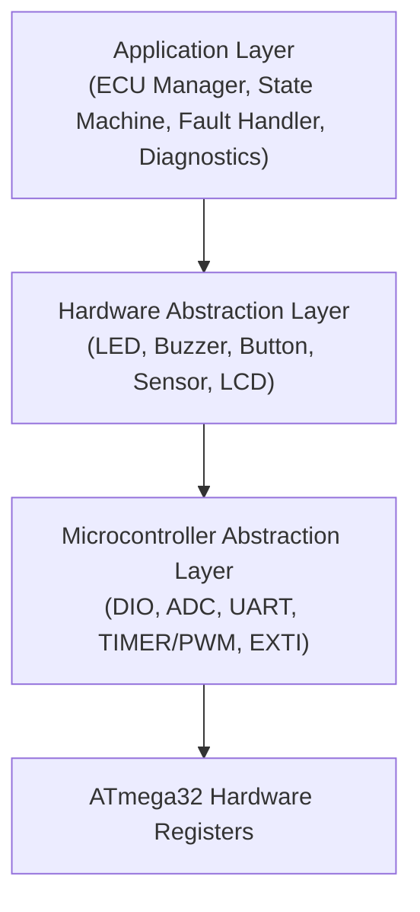
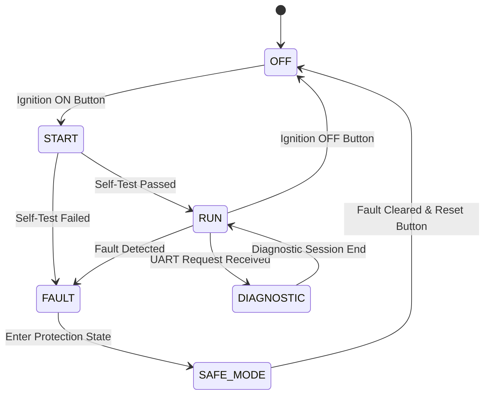
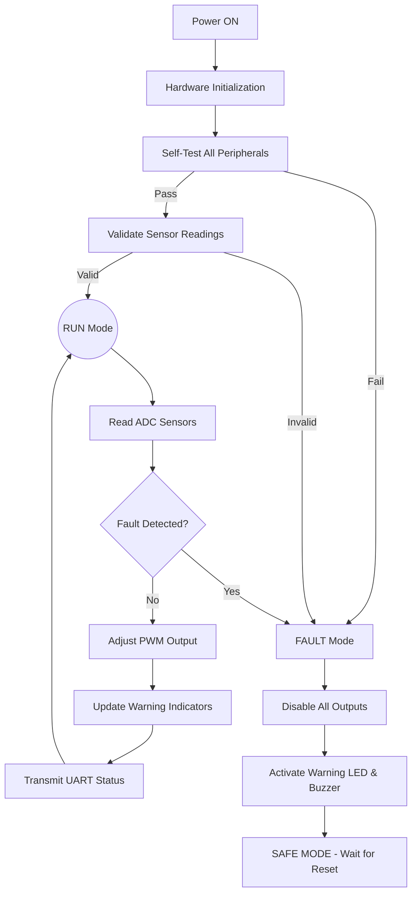
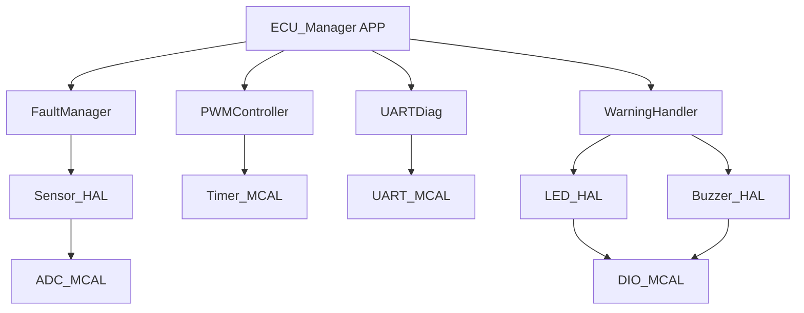

# 🚗 Automotive Electronic Control Unit (Mini ECU)

### AVR Embedded Systems Graduation Project

---

<p align="center">

**ATmega32 | Embedded C | Layered Architecture | State Machine | Automotive Control**

</p>

---

# 🚀 Message from the Team Leader

**Hello Team — CtrlDrive,**

Welcome to the **Automotive Electronic Control Unit (Mini ECU)** project! This is one of the most technically demanding and exciting projects in the program. We are going to simulate a real-world automotive ECU that manages and supervises multiple vehicle subsystems based on operating conditions, sensor inputs, and predefined control logic.

This is not just another embedded project. The automotive domain requires a **high level of discipline** in our software architecture. We will implement a **proper State Machine** with well-defined operating modes (OFF, START, RUN, FAULT, DIAGNOSTIC), a **Fault Management System** with real fault codes, and a **UART Diagnostic Interface** to communicate ECU status like a real vehicle OBD system.

Every function you write must be documented using the **Doxygen comment style**. Every module must be independent and tested in isolation before integration. We follow a strict **Layered Architecture (MCAL → HAL → APP)**.

**Important Note:** Before we move to physical hardware, we will design and fully simulate the circuit using **Proteus Professional**. This will let us validate the entire ignition sequence, fault injection, and UART diagnostics in a safe environment.

Let's build something we're proud of — a system worthy of the automotive industry!

*— Eng. Hesham Ahmed, Team Supervisor*

---

# 📋 Table of Contents

1. [Project Overview](#project-overview)
2. [Functional Requirements](#functional-requirements)
3. [Non-Functional Requirements](#non-functional-requirements)
4. [System Architecture &amp; Layers](#system-architecture--layers)
5. [Hardware Components](#hardware-components)
6. [ATmega32 Pin Assignment](#atmega32-pin-assignment)
7. [Modules &amp; Drivers to Develop](#modules--drivers-to-develop)
8. [System Diagrams](#system-diagrams)
   * [ECU State Machine](#ecu-state-machine)
   * [ECU Operating Flow](#ecu-operating-flow)
   * [Module Dependency Diagram](#module-dependency-diagram)
9. [Fault Management System](#fault-management-system)
10. [UART Diagnostic Interface](#uart-diagnostic-interface)
11. [Project Organization &amp; Team](#project-organization--team)

---

# 📖 Project Overview

The **Automotive Mini ECU** is an embedded control system built around the **ATmega32 AVR Microcontroller**. It simulates the core behavior of a vehicle's Electronic Control Unit — from startup ignition sequences to fault detection and safe-state management. The system monitors analog sensors (temperature, battery voltage), controls PWM-driven actuators (engine fan/motor simulation), manages visual/audio warning indicators, and communicates diagnostic data to a PC terminal over UART.

---

# ⚙️ Functional Requirements

Our system must implement the following core functionalities:

## 1. Ignition & Startup Sequence

* On power-on, the ECU performs a structured initialization:
  1. **Power On** → Hardware initialization
  2. **Self-Test** → Verify peripheral health
  3. **Sensor Validation** → Check ADC inputs are within range
  4. **Ignition Enable** → Unlock RUN mode
* If Self-Test or Sensor Validation fails → System enters **FAULT Mode** immediately.

## 2. Operating Modes

### OFF Mode

* Ignition is disabled. All outputs are inactive. System waits for an Ignition ON event.

### START Mode

* Runs initialization and self-check routines. Transitions to RUN on success or FAULT on failure.

### RUN Mode (Normal Operation)

* Continuously reads sensors via ADC.
* Controls outputs and PWM actuators (fan/motor speed).
* Monitors for faults in real-time.
* Updates any status LEDs and UART diagnostics.

### FAULT Mode

* Entered when a critical fault is detected (over-temperature, low battery, sensor failure).
* All PWM outputs are disabled.
* Warning LED and Buzzer are activated.
* ECU enters **SAFE MODE** — preventing unsafe restart until fault is acknowledged.

### DIAGNOSTIC Mode

* Triggered via a UART command from the PC terminal.
* Transmits real-time ECU Status: Sensor values, Engine mode, Fault codes, PWM duty cycle.
* Returns to RUN mode after diagnostic session ends.

## 3. Fault Detection & Reporting

* ECU continuously monitors:
  * Engine temperature (LM35 via ADC): triggers fault if `Temp > Threshold`.
  * Battery voltage (Potentiometer via ADC): triggers fault if `V < Low Limit`.
  * Sensor disconnection: detects out-of-range ADC readings.
  * Communication failure: UART timeout detection.
* Every detected fault generates a **Fault Code**, activates a **Warning Indicator**, and logs a **UART Report**.

## 4. Warning Indicators

* **Power LED:** System is powered and initialized.
* **Engine Status LED:** Engine is running normally in RUN mode.
* **Warning LED:** A fault condition has been detected.
* **Fault LED:** System is in SAFE MODE after a critical fault.
* **Buzzer:** Audible alarm for critical fault states.

## 5. UART Diagnostic Interface

* Sends periodic status messages to a PC terminal (e.g., Serial Monitor).
* Accepts incoming commands to trigger a DIAGNOSTIC session.
* Data format includes mode, temperature, battery voltage, and fault code.

---

# 🛡️ Non-Functional Requirements

To ensure a professional, automotive-grade software product, the team must adhere to:

* **Modular Design:** Strictly follow the Layered Architecture (MCAL → HAL → APP).
* **State Machine Integrity:** Never access hardware directly from APP — always go through HAL.
* **Fault-Safe Behavior:** Any unhandled condition must default to the FAULT/SAFE state, never undefined behavior.
* **Interrupt-Driven:** Use EXTI for ignition button events; use Timers for periodic tasks — no busy waiting.
* **Doxygen Documentation:** All source files, functions, and macros **must** be documented using the **Doxygen** comment style. Every driver file must include a file header block, and every function must have a description, `@param`, and `@return` tags.
* **Code Reusability:** Drivers must be portable and independent of application logic.

---

# 🏗️ System Architecture & Layers



---

# 🔌 Hardware Components

| Component                         | Purpose / Function in Project                   |
| :-------------------------------- | :---------------------------------------------- |
| **ATmega32**                | Main ECU Microcontroller                        |
| **LM35 Sensor**             | Engine Temperature Monitoring (via ADC)         |
| **Potentiometer**           | Battery Voltage Simulation (via ADC)            |
| **LEDs (x4)**               | Power, Engine Status, Warning, Fault indicators |
| **Push Buttons**            | Ignition ON/OFF, Fault Reset                    |
| **Buzzer**                  | Audible Fault Alarm                             |
| **LCD 16x2** *(Optional)* | ECU Status Display                              |
| **UART (CH340)**            | PC Diagnostic Interface                         |
| **PWM Output**              | Motor/Fan Speed Control (Engine Simulation)     |

---

# 📌 ATmega32 Pin Assignment

To ensure everyone is on the same page while designing the Proteus schematic and writing the MCAL drivers, here is the unified hardware pin mapping:

| Port            | Pin            | Hardware Component           | Description                                  |
| :-------------- | :------------- | :--------------------------- | :------------------------------------------- |
| **PORTA** | `PA0` (ADC0) | **LM35 Sensor**        | Engine Temperature Analog Input              |
|                 | `PA1` (ADC1) | **Potentiometer**      | Battery Voltage Simulation Input             |
| **PORTB** | `PB3` (OC0)  | **PWM Output**         | Timer0 PWM for Motor/Fan Speed Control       |
| **PORTC** | `PC2`        | **LCD RS**             | Register Select*(Optional)*                |
|                 | `PC3`        | **LCD EN**             | Enable*(Optional)*                         |
|                 | `PC4`        | **LCD D4**             | Data Line 4*(Optional)*                    |
|                 | `PC5`        | **LCD D5**             | Data Line 5*(Optional)*                    |
|                 | `PC6`        | **LCD D6**             | Data Line 6*(Optional)*                    |
|                 | `PC7`        | **LCD D7**             | Data Line 7*(Optional)*                    |
| **PORTD** | `PD0` (RXD)  | **UART**               | Receive Commands from PC Diagnostic Terminal |
|                 | `PD1` (TXD)  | **UART**               | Transmit ECU Status & Fault Codes to PC      |
|                 | `PD2` (INT0) | **Ignition Button**    | Ignition ON (External Interrupt)             |
|                 | `PD3` (INT1) | **Fault Reset Button** | Reset fault and return to OFF state          |
|                 | `PD4`        | **Power LED**          | System Initialized                           |
|                 | `PD5`        | **Engine Status LED**  | RUN Mode Active                              |
|                 | `PD6`        | **Warning LED**        | Fault Detected                               |
|                 | `PD7`        | **Buzzer**             | Critical Fault Alarm                         |

> **Action Item for the Hardware Team:** Please strictly follow this mapping when building the Proteus simulation. This guarantees our software drivers will perfectly match the hardware without integration conflicts.

---

# 🛠️ Modules & Drivers to Develop

The team needs to develop the following modules from scratch.
*(Note: Tasks will be divided among the team members)*

### MCAL (Microcontroller Abstraction Layer)

* `DIO`: Digital Input/Output for all LEDs, Buttons, and Buzzer.
* `ADC`: Analog to Digital Conversion for temperature and battery voltage sensors.
* `UART`: Serial communication for the PC diagnostic interface.
* `TIMER / PWM`: Timer0 in Fast PWM mode to control the motor/fan duty cycle.
* `EXTI`: External interrupts for the Ignition button and Fault Reset button.

### HAL (Hardware Abstraction Layer)

* `LED Driver`: Manages the 4 indicator LEDs with named identifiers.
* `Buzzer Driver`: Alarm activation/deactivation.
* `Button Driver`: Interrupt-driven and polling-based button reading.
* `Sensor Driver`: ADC wrapper to map raw readings to `°C` (LM35) and `Voltage` (battery).

### APP (Application Layer)

To keep the application logic organized, we will divide the APP layer into the following sub-modules:

* `Main Scheduler`: The core loop executing all ECU tasks without blocking.
* `ECU State Machine`: Manages transitions between (OFF, START, RUN, FAULT, SAFE_MODE, DIAGNOSTIC) states.
* `Fault Manager`: Checks sensor readings against thresholds, assigns fault codes, and triggers protection responses.
* `PWM Controller`: Sets the duty cycle of the motor/fan output based on temperature readings in RUN mode.
* `UART Diagnostic Protocol`: Formats and transmits ECU data to PC. Parses incoming commands to initiate DIAGNOSTIC mode.
* `Warning Handler`: Translates active fault flags into LED and Buzzer outputs.

---

# 📊 System Diagrams

## ECU State Machine



## ECU Operating Flow



## Module Dependency Diagram



---

# 🚨 Fault Management System

| Fault Code | Condition                              | Action                                     |
| :--------: | :------------------------------------- | :----------------------------------------- |
|  `F001`  | Engine Temperature > Limit             | Disable PWM, Activate Warning, Enter FAULT |
|  `F002`  | Battery Voltage < Limit                | Disable all outputs, Enter FAULT           |
|  `F003`  | Sensor Disconnection (ADC = 0 or 1023) | Flag invalid reading, Enter FAULT          |
|  `F004`  | ADC Conversion Timeout                 | Log ADC error, Enter FAULT                 |
|  `F005`  | UART Communication Failure             | Log UART error, Continue in RUN mode       |

---

# 🩺 UART Diagnostic Interface

When in DIAGNOSTIC mode, the ECU will transmit the following status report to the PC terminal:

```
================================
    ECU DIAGNOSTIC REPORT
================================
 ECU STATUS   : RUNNING
 ENGINE MODE  : RUN
 TEMPERATURE  : 42 C
 BATTERY      : 12.3 V
 PWM DUTY     : 75%
 ACTIVE FAULT : NONE
================================
```

---

# 👥 Project Organization & Team

We will be following an Agile approach, tracking our tasks and ensuring every layer is thoroughly tested before integration.

| Role                      | Name                        | Suggested Responsibilities                    |
| :------------------------ | :-------------------------- | :-------------------------------------------- |
| **Team Supervisor** | **Eng. Hesham Ahmed** | Architecture Review, Integration, Code Review |
|                           |                             |                                               |

---

<p align="center">
<b>Let's build a system worthy of the automotive industry. Good luck team CtrlDrive!</b><br><br>
Embedded Systems Graduation Project using <b>ATmega32 AVR Microcontroller</b><br>
Made with ❤️ by Team CtrlDrive.
</p>
